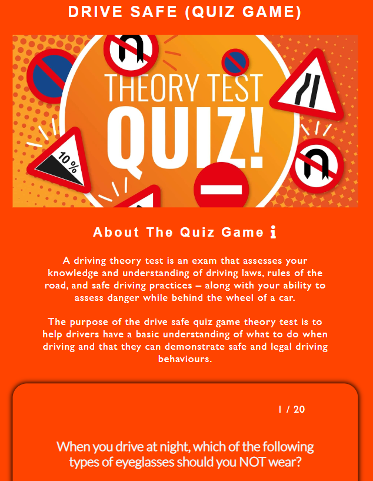
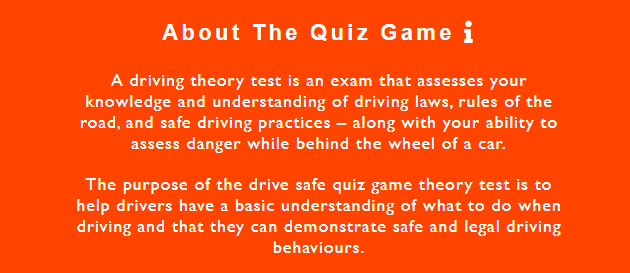
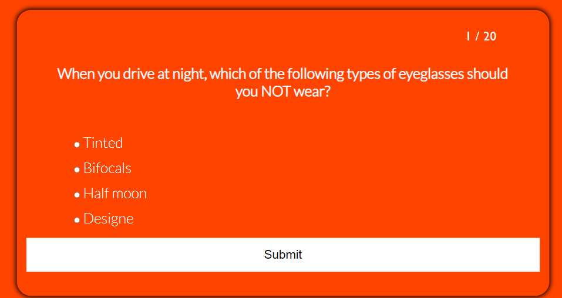
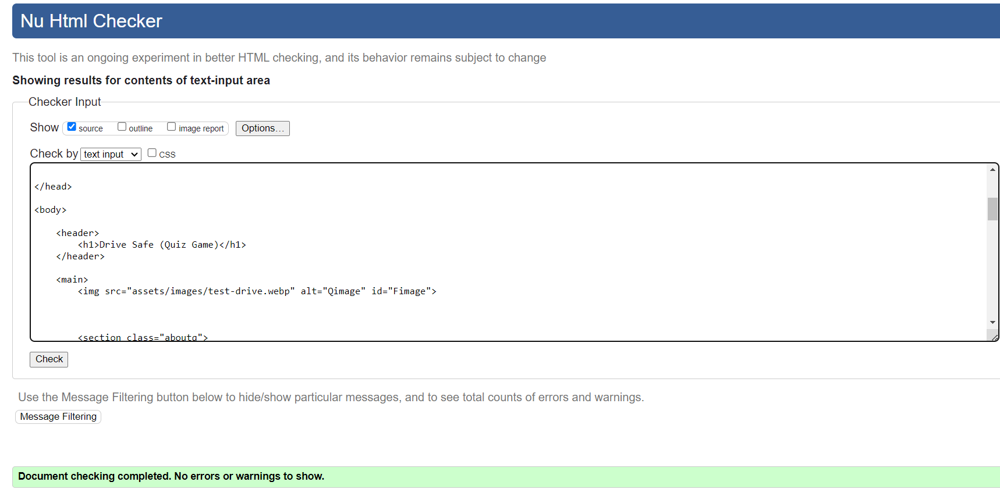
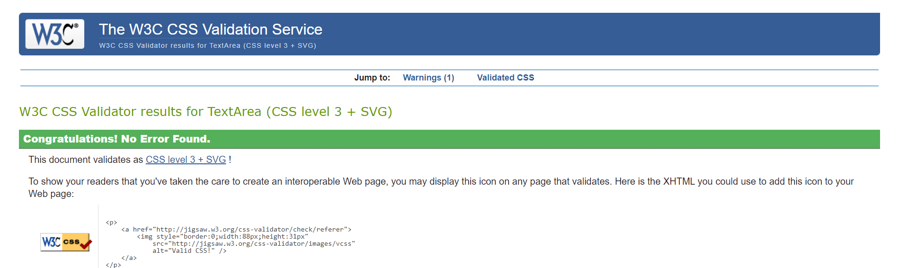
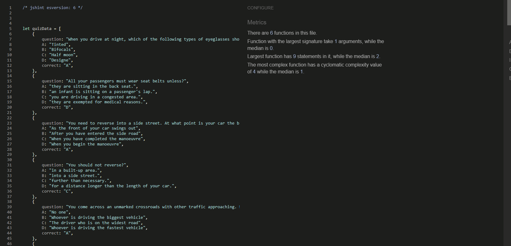
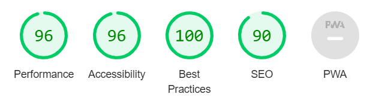
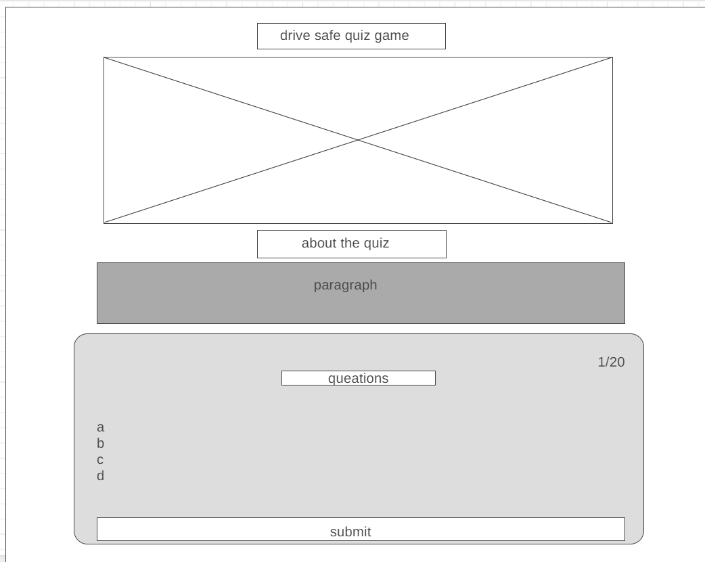
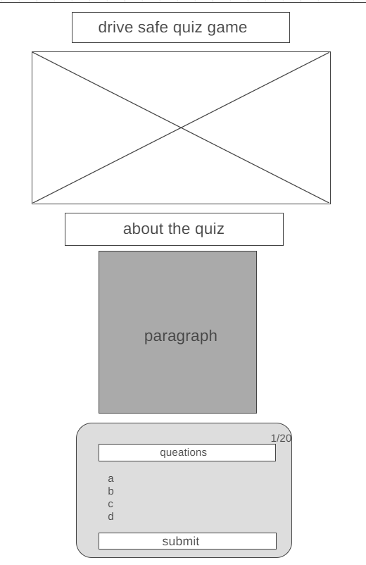

# Drive-Safe-Test-Quiz
Drive-safe-test-quiz is a web for theory driving test practice .

In this website, drivers can practice the theory test. The test contains 20 questions about knowledge, understanding of driving laws and rules of the road.

---

---

## Technologies used

- HTML
- CSS
- JavaScript 
- Google Fonts

---

## User stories

- As a first-time visitor, I want a simple website so I can practice for my driving theory test.
- As a first-time visitor, I want to be able to easily start the test.
- As a first-time visitor, I want to see the information about the questions goals.
- As a first-time visitor, I want to be able to retake the test more than once.
- As a mobile device user, I want the website to be responsive, so I can use my phone or tablet to visit.

---

## Features

### Home page

- ##### Home

  - Containes a header.
  - Contains an image in the center.
  - Orange back-ground color.
  - Contains About the quiz game secation.
  - Contains a test form.
  

  
  

---

- ##### About The Quiz Game !
  About section contain an explanation of:
    - What this test for.
    - The purpose of the test.

      

---

- #####  Quiz Form
  - Contains 20 questions .
  - Four inputs A ,B ,C ,D to chose the answers.
  - A counter in the top right side of the form.
  - Submit bottom.
    

---

### Testing

- I tested that the website works in different browsers: Chrome, Firefox, Microsoft edge.
- I used -Am I Responsive- website to check all media sizes responsive[Am-I-Responsive](https://ui.dev/amiresponsive)
- I confirmed that this project responsive , looks good and functions on all standard screen sizes using devtools device toolbar.

### Bugs

- ##### Solved bugs
  - I had an error (failed to load resource: the server responded with a status of 404 (). )
    - Favicon was missing , i used [Favicon](https://favicon.io/) to get the icon and the link i need .

  - I had missing semicolons 
    - I used [JS.Hint](https://jshint.com/) to check all my JS code and find the missing semicolons 

- ##### Unsolved bugs
  - None.

---

### Validator testing

- ##### HTML
  - No errors or warnings were found when passing through the official W3C validator.
    
- ##### CSS
  - No errors or warnings were found when passing through the official W3C (Jigsaw) validator.
    
- ##### JavaScript
  - No errors or warnings were found when passing through the JS Hint.
    
- ##### Accessibility and performance
  - Using lighthouse in devtools I confirmed that the website is performing well, accessible and colors and fonts chosen are readable.
    

---

### Deployment

- This site was deployed to Github pages, The steps to deploy are as follows:

- In the Github repository , navigate to the Settings tab

- From the source section drop-down menu, select the main Branch

- Once the main branch has been selected , the page provide the link to the website

-  Live link: [Drive Safe Quiz Game](https://naifzaghmout.github.io/Drive-safe-quiz-game/)

---

### Credits

- ##### Content
  - The quiz questions was taken from [DVSA](https://www.gov.uk/book-theory-test) (A theory driving school in UK).
  - To make quiz fields I watched some videos of [Code with Nick](https://www.youtube.com/@CodingWithNick) on YouTube .
- ##### Media
  - The images for the website was taken from [Google](https://www.google.com/search?hl=en&sxsrf=APwXEdcDO-XWNC_BbNB2RjPJEdPWY6FS6w:1688130478926&q=theory+driving+test&tbm=isch&sa=X&ved=2ahUKEwjcgp-MiOv_AhWwh_0HHTQXBDEQ0pQJegQICxAB&biw=1707&bih=837&dpr=1.13)
  

---

#### Wireframes

